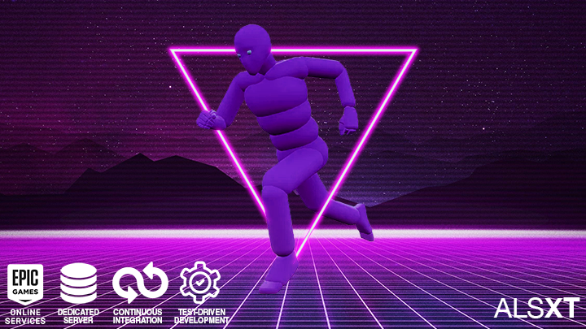

# Target Vector
An Unreal Engine 5 Template utilizing EOS (Epic Online Services), Dedicated Server, Steam, Modular Gameplay, Common UI, Advanced Locomotion System Refactored XT, Lyra Modeling Tools and more.

This template also employs Test-Driven Development (TDD) and Continuous Integration (CI) and assumes working knowledge of C++, Jenkins and Unit Testing.

# Table of contents
1. [Introduction](#introduction)
2. [Basic Setup](#basic-setup)
    1. [Requirements](#basic-requirements)
    2. [EOS Setup](#eos-setup)
    3. [Code](#code)
    4. [Testing](#testing)
    5. [Troubleshooting](#troubleshooting)
3. [Advanced Setup](#advanced-setup)
    1. [Requirements](#advanced-requirements)
    2. [The CI/TDD Development Process](#The-CI/TDD-Development-Process)
    3. [First Time Steps](#First-Time-Steps)
    4. [Jenkins Setup](#Jenkins-Setup)
    5. [The Jenkinsfile](#The-Jenkinsfile)
    4. [Discord Setup](#Discord-Setup)
    5. [Automated Testing](#Automated-Testing)
4.	[Attributions](#Attributions)

# Introduction

**UPDATE**

**Currently under re-factoring for modularity. All functionality has been migrated into TargetVector* plugins (TargetVectorEOS, TargetVectorCommonUi etc.), leaving the project empty. Documentation update is coming soon. Please update your forks regularly.**

**Features**

- The EOSGameInstance C++ class exposes basic EOS functionality such as Login, Friends, Invites, and Creating and Joining Sessions to Blueprint. EOSPlus allows for a secondary authentication system (Steam by default).
- Modular Gameplay ready with UIExtension to improve Mod/UGC Authoring workflows in actors and UIs.
- CommonUI based main menu system with Tabbed navigation, Input Routing, Loading Screen, Primary Layout and Async Mixin implementation (Push Widget).
- Server Browser (via helper functions (work in progress)). 
- Advanced Locomotion System Refactored: Expanded Character States, Improved Foot Print system, Sliding and Vaulting (XT) _Coming Soon_.
- Modeling Tools: The Lyra Procedural Level block out tools using Geometry Script adapted into a plugin.
- TTToolbox: Various editor tools to facilitate retargeting characters and animations to the ALS skeleton.
- SkeletalMeshMerger: Merge skeletal component at run-time.
- Test-Driven Development (TDD) and Continuous Integration (CI)

**Dependecies**

- OnlineSubsystemEOS
- OnlineServicesEOS
- OnlineSubsystemSteam
- Common UI

**Core Plugins**

- [ALSXT](https://github.com/Voidware-Prohibited/ALSXT)
- [TargetVectorEOS](https://github.com/Voidware-Prohibited/TargetVectorEOS)
- [TargetVectorCommonUI](https://github.com/Voidware-Prohibited/TargetVectorCommonUI)
- [TargetVectorDebugNetStats](https://github.com/Voidware-Prohibited/TargetVectorDebugNetStats)
- [TargetVectorContent](https://github.com/Voidware-Prohibited/TargetVectorContent)

**Included Additional Plugins**

- [Advanced Locomotion System Refactored](https://github.com/Sixze/ALS-Refactored/)
- [TTToolbox](https://github.com/tuatec/TTToolbox)
- [SkeletalMeshMerger](https://github.com/WHITEJAIL/SkeletalMeshMerger)
- [VaREST](https://github.com/ufna/VaRest)

**External Dependencies**
These plugins will need to be copied from the Lyra Starter Kit plugin folder into this projects plugin folder.

- AsyncMixin
- Common Gameplay
- Common User
- Game Features
- Modular Gameplay
- UIExtension

_This is currently a work in progress, and not production-ready_

# Basic Setup
Setup for EOS and Dedicated Server

## Basis Requirements

- Unreal Engine 5.0.2 or later built from github Source Code
- Visual Studio 2017 or newer
- clang -20 13.0.1

## Unreal Engine 5 Source Build Setup

1. Clone or download the release branch from the Epic Games github repository. This will be the source build you base your project and builds on from now on.
2. Launch **Setup.bat** and let it complete.
3. Launch **GenerateProjectFiles.bat** and let it complete.
4. Open **UE5.sln**
5. In the Solution Explorer, Right click on UE5 and click Build and allow it to successfully complete its initial build.

## Setup for Linux Cross-Compile

1. Download and Install [clang -20 13.0.1](https://cdn.unrealengine.com/CrossToolchain_Linux/v20_clang-13.0.1-centos7.exe) to the default folder
2. In the Unreal Engine top folder launch GenerateProjectFiles.bat again and allow it to complete.
3. In the same folder launch Setup.bat again and allow it to complete.
4. Open UE5.sln again. In the Standard Toolbar at the top Linux should now be available as a Target.
5. Rebuild UE5 in Visual Studio
6. After rebuilding, open the Target Vector project again. In open Map tab click the drop-down menu next to "Platforms". If everything is setup correctly Linux should appear in the Content/SDK/Device Management list

**Linux Cross-Compile Notes**

- For packaging for Linux platforms (both x86_64 and ARM) the CrashReportClient is also needed to be built for the Linux configuration.
- If packaging for Linux fails with error message "unable to find UnrealPak or ShaderCompileWorker" it may be necessary to explicitly build UnrealPak and ShaderCompileWorker for the host platform, which in this case is windows (Win32 or Win64). To do this right-click on each of this project in the solution explorer and execute the "Build" command.
- If starting UnrealEditor fails with message about not able to find libfbxsdk.dll, this can be fixed by copying libfbxsdk.dll from ...\UnrealEngine\Engine\Source\ThirdParty\FBX\2014.2.1\lib\vs2012\x64\release to the same location as the UnrealEditor executable file where ...\UnrealEngine is the top location of the UE4 source code. For Win32 systems use the file located under ...\x86\release instead.

### Additional Step for Linux-ARM platforms

An additional step is required for the packaged project to be runnable on Linux-ARM platforms. The following has been verified using the SunTemple project packaged using Unreal-4.6 and executed on NVIDIA's Jetson TK1 platform.

Assuming the packaged project is located at \Users\foo\SunTemple_Linux open the following location:
\Users\foo\SunTemple_Linux\LinuxNoEditor\Engine\Binaries\Linux
and replace libopenal.so.1 with the version from:
...\UnrealEngine\Engine\Source\ThirdParty\OpenAL\1.15.1\lib\Linux\arm-unknown-linux-gnueabihf\libopenal.so
where ...\UnrealEngine is the location of the UE4 source code. Please be sure to rename libopenal.so to libopenal.so.1.

## Project Setup

1. Create a subdirectory at the top directory of your Unreal Engine 5 Source Build called **Projects**
2. Clone this project into the **Projects** folder. The structure should look like /Projects/[Name of this Repository]
3. In the Unreal Engine top folder launch **GenerateProjectFiles.bat** again.
4. Once finished, open the **UE5.sln** file and TargetVector should appear under the Games folder.
5. This will be the Visual Studio solution you will use for your project from now on.

## EOS Setup

This project is configured to read EOS Artifacts from **EOSSettings.ini**, which for securirity purposes, requires you to create it, and is set up to be ignored in the .gitignore file.

In the Config folder create a text file named **EOSSettings.ini** and copy and paste the following:

    [/Script/OnlineSubsystemEOS.EOSSettings] 
    +Artifacts=(ArtifactName="EOSArtifact",ClientId="",ClientSecret="",ProductId="",SandboxId="",DeploymentId="",EncryptionKey="")

Complete the required Artifacts fields in the ini file. These values can be found in Application Details in your Epic Dev Portal.
It is highly recommended to keep your Artifacts in this ini file instead of editing the values in the Editor.

Open the Project with the Editor and in Project Settings > Maps & Modes select the EOS_GameInstance class in the Game Instance Class drop-down menu.

### Code
Source code for the EOS Game Instance class can be found in the Source folder inside the Project folder. You are encouraged to expand, improve or sub-class the EOSGameInstance C++ class to meet the unique requirements of your project.

CommonUI functionality is implemented in the B_PlayerController, B_MainMenuController and B_HUD Classes.
Source code for ALS_Refactored_XT can be found in the Plugins folder inside the Project folder.

### Testing
To test the basic EOS functionality use the **EOS_Testing.bat** file. Edit the "ue5path" varible to reflect your Unreal Engine 5 installation directory. Currently, to test EOS functionality between multiple players you will need an Epic and Steam login for each player. 

Developer Authentication Tool _should_ also work

### Troubleshooting
When testing, the Epic Games Overlay and Steams Overlay should always appear. If not, check your log files and verify all the EOS Artefacts are correct. Incorrect or incomplete EOS setup may also result in crashes.

# Advanced Setup

Setup for Test-Driven Development (TDD) and Continuous Integration (CI)

## Advanced Requirements

- Unreal Engine 5 5.0.2 or later built from github source code
- Visual Studio 2017 or newer
- clang -20 13.0.1
- Java 11
- Jenkins
- Git
- Github
- Domain Name or ngrok
- OpenCppCoverage

## The CI/TDD Development Process

1. Make local changes

2. Commit and push changes to git remote repository (or Pull Request) 

3. Github receives the push and uses it's webhook to notify Jenkins (via Domain Name, Dynamic DNS or ngrok).

4. Jenkins receives a notification that a repository included in a pipeline has received a push.

5. Jenkins pulls each change to the remote repository into the Jenkins workspace.

6. Jenkins starts the pipeline associated with that repository.

7. The Pipeline builds the project.

8. The Pipeline runs tests while doing code coverage.

9. The Pipeline displays build status and tests reports.

10. Jenkins notifies Github and Discord of the results of the pipeline build.

The Rule: Test > Refactor > Test

### First Time Steps

0. Install all required programs.

1. Setup a Domain Name, Dynamic DNS or use ngrok access Jenkins via port (default is 8080).

2. Setup Jenkins

3. Setup Discord

4. Create Unreal Project

5. [Setup EOS](#EOS-Setup)

5. Create Jenkins Multibranch Pipeline project

6. Push project changes to remote git server to activate the build trigger in Jenkins

### Install Programs

1. Unreal Engine 5
2. Git
3. Java
4. Jenkins
5. OpenCppCoverage

### Jenkins Setup

In Jenkins Install these plugins:

- Blue Ocean plugin (there're plugins necessary with it and if you want a prettier Jenkins).
- GitHub plugin (for pull requests).
- HTTP request plugin (may no longer be necessary).
- Cobertura plugin (for code coverage).
- discordSend (if you want discord notifications).

After installing plugins:

1. Add Github Credentials: Go to Job > Configure > Branch Sources and Click Add your github credentials om the folder named after the project/job.
2. [Setup Discord Plugin](#Discord-Setup)
      
#### The Jenkinsfile

- Node 'master' is used for a single Jenkins install.
- A custom workspace is used with consideration that the Unreal Build Tool has problems with long file and directory names.
- Environment variables are used as parameters, to avoid hardcoding.
- BuildWithoutCooking.bat builds the project. Cooking is disabled because that should be a seperate CD task.
- It's not necessary for Jenkins to create the Visual Studio files because we run the tests using the Unreal Automation Tool.
- TestRunnerAndCodeCoverage uses OpenCppCodeCoverage attached to the Unreal Engine Editor (which runs the Automated Unit Tests).
- TestRunnerAndCodeCoverage.bat assumes that you have a separate folder for tests (\Source\Tests).
- The Tests Report is made in JSON so we need to parse it to XML to be readable by JUnit. Thanks to Michael Delva for his test report parser method found in his [blogspot](https://www.emidee.net/ue4/2018/11/13/UE4-Unit-Tests-in-Jenkins.html), I modified it only a little.
- The CodeCoverageReport will be used by Cobertura to display the code coverage and attach it to the build.
- Throughout the pipeline discordSend is used to send messages to the pre-configured Discord channel.
- A git hard reset and git clean is performed to clean the workspace after completion and save bandwidth.

TODO: Pull requests

### Discord Setup
The discordSend Jenkins plugin is used to send messages to a Discord channel. The Webhook for Discord must be defined with the TVDISCORDWEBHOOK Environment Variable in Jenkins. 

1. In Discord right click on the channel you want Jenkins to send messages to and click Edit Channel.
2. Navigate to Integrations > Webhooks and click New Webhook
3. Name it to whatever you want and click Copy Webhook 
4. In Jenkins Navigate to Manage Jenkins > Configure System > Global Variables and check Environment Variables (if not already checked).
5. Click the Add button
6. In the new entry enter TVDISCORDWEBHOOK as Name
7. Paste the Webhook copied from your Discord Channel Settings
8. Click the Save and Apply buttons

### Automated Testing

Included are 2 simple C++ tests in the "Game." group that are already setup to run in the Jenkinsfile and a VoidWorld map.
Create new C++ tests in the /Source/Tests folder and add them to the "Game." group to automatically run Testing and Code Coverage with Jenkins builds.
Alternatively modify the Jenkinsfile to use another test group or a specific test.

# License

Original content and code in this repository is under the MIT license. Any git submodules are covered by their respective licenses. Content listed in the Attributions are covered by their respective licenses.

# Attributions

- [Palm Trees](https://sketchfab.com/3d-models/palm-trees-55690379305145488e20afb05fc687e6) by [Erroratten](https://sketchfab.com/erroratten) [License: CC Attribution](https://creativecommons.org/licenses/by/4.0/) Modified to be seperate meshes

- [LOOP surf on 100m sandbeach 01 170508_1135.wav](https://freesound.org/people/klankbeeld/sounds/392886/) by [klankbeeld](https://freesound.org/people/klankbeeld/) [License: CC Attribution](https://creativecommons.org/licenses/by/4.0/) Modified to be shorter

- [Female Grunts For Games](https://freesound.org/people/SkyRaeVoicing/sounds/368843/) by [Sky Rae Voicing](https://freesound.org/people/SkyRaeVoicing/) [License: CC BY 3.0](https://creativecommons.org/licenses/by/3.0/) Modified to be seperate sounds

- [Tactical Knife](https://sketchfab.com/3d-models/tactical-knife-db381f4766cf453aa9b80822b0b95361) by [slimecent](https://sketchfab.com/slimecent) [License: CC Attribution](https://creativecommons.org/licenses/by/4.0/) Modified to fix and bake materials

- [Tactical Axe 2](https://sketchfab.com/3d-models/tactical-axe2-e4fa55bab1d1433aaa8e8f563fd7ac05) by [TORI106](https://sketchfab.com/TORI106) [License: CC Attribution](https://creativecommons.org/licenses/by/4.0/) Modified to optimize textures

- [Bench 02](https://sketchfab.com/3d-models/bench-02-0fc91c47c6b04717bb4400c247de573e) by [Ricardo Sanchez](https://sketchfab.com/380660711785) [License: CC Attribution](https://creativecommons.org/licenses/by/4.0/)